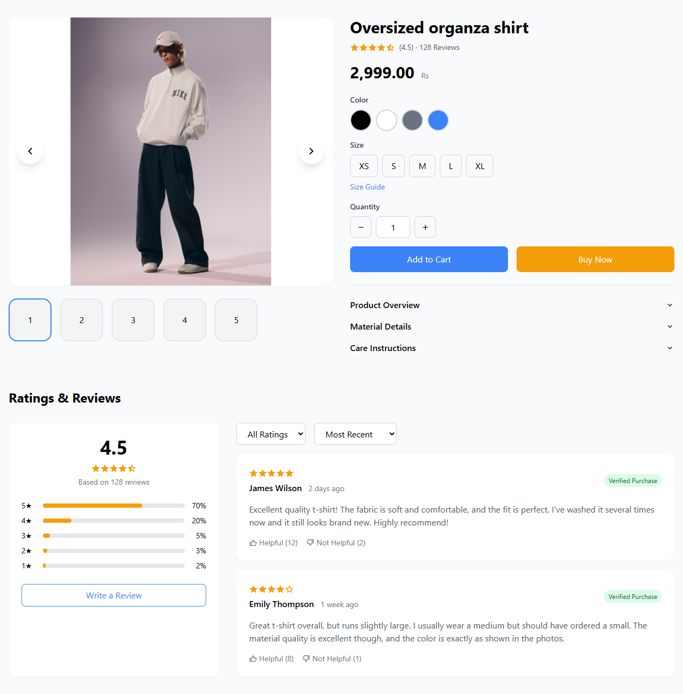
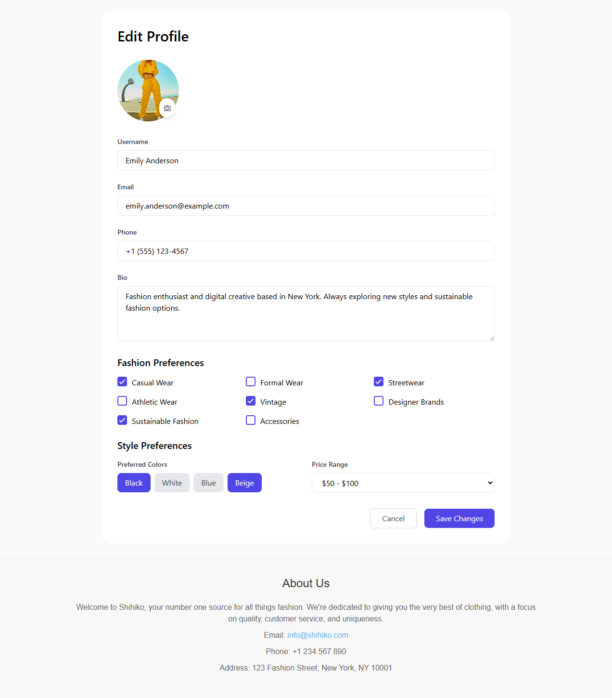

# E-Commerce Website 

Welcome to the **E-Commerce Website** repository. This project is a premium, brutalist, and editorial-styled modern fashion e-commerce frontend. Built strictly using HTML, Tailwind CSS, and vanilla JavaScript, it provides an elevated user experience with interactive UI elements, glassmorphism design traits, and a clean layout flow.

## 🚀 Features
- **Responsive Layout**: Fully responsive designs adapted for mobile and large screens.
- **Dynamic Product Rendering**: Products are rendered through JavaScript arrays to keep markup clean.
- **Editorial Aesthetics**: Bespoke layouts for individual category pages instead of standard generic grids.
- **Smooth Animations**: Tailored micro-interactions and hover effects to increase user engagement.

## 📸 Page Previews

Here is a visual walkthrough of the platform, structured logically by user flow:

### 1. Home / Dashboard
The main landing page featuring an immersive video hero, curated category highlights, and a dynamically loaded product grid.
<br><br><br>

<br><br><br>

---
<br>

### 2. New Arrivals
A dynamic page for the latest drops, accented with a modern infinite-scrolling marquee ticker.
<br><br><br>

<br><br><br>

---
<br>

### 3. Men's Collection
A high-end presentation for menswear using a sophisticated split-screen hero layout and refined typography.
<br><br><br>

<br><br><br>

---
<br>

### 4. Women's Edit
A minimalist, editorial-styled showcase specifically designed for women's fashion lines.
<br><br><br>

<br><br><br>

---
<br>

### 5. Collections
A curated view of seasonal selections utilizing a sticky navigation sidebar for easy browsing between drops.
<br><br><br>

<br><br><br>

---
<br>

### 6. Product Details
An immersive, focused view for individual items featuring a main image viewer and interactive thumbnails.
<br><br><br>

<br><br><br>

---
<br>

### 7. User Profile
A clean, functional dashboard for users to manage their details, orders, and wishlist.
<br><br><br>

<br><br><br>

---
<br>

## 🛠️ Technologies Used
- **HTML5** for structural foundation.
- **Tailwind CSS** via CDN for rapid, consistent styling.
- **Vanilla JavaScript** for logic and interactivity.
- **RemixIcon** for iconography.
- **Google Fonts** (Outfit, Cormorant Garamond, Inter).

## 📥 Installation & Usage
1. Clone the repository.
2. Serve the directory using any local web server. For example:
   ```bash
   python -m http.server 8000
   ```
3. Navigate to `http://localhost:8000/dashboard.html` to begin browsing.

---
*Designed for a luxurious online shopping experience.*


## ☕ Support the Project
If you found this project helpful, consider supporting its development!

<a href="https://www.buymeacoffee.com/adityaxdeore" target="_blank"></a>

## 🔍 Keywords / Tags
`E-commerce` `Fashion` `Tailwind CSS` `JavaScript` `Frontend` `UI/UX` `Web Design` `Responsive Design` `Brutalist Design` `Glassmorphism` `HTML5` `CSS3` `Shopping Cart` `Product Grid` `Modern Web` `Interactive UI`